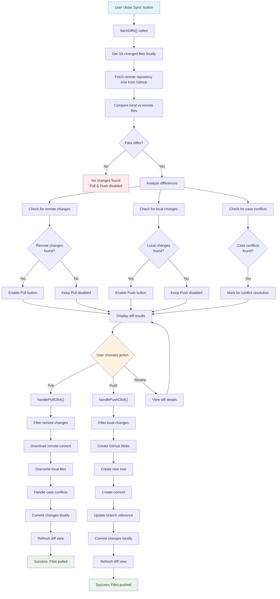

# Kolaba


Keep your notes synchronized across devices with GitHub repositories.

Kolaba is an Obsidian plugin that enables seamless synchronization of your notes between multiple devices using GitHub as the backend. Whether you're switching between your laptop, desktop, or mobile device, your notes stay perfectly in sync.

## ✨ Features

### 🔄 Smart Synchronization
- **Bidirectional Sync**: Push local changes to GitHub and pull remote changes to your device
- **Intelligent Change Detection**: Only processes files that have actually changed for optimal performance
- **Three Sync Modes**:
  - **Sync**: Detect and review all changes between local and remote
  - **Pull**: Download remote changes and new files to your local vault
  - **Push**: Upload local changes and deletions to GitHub

### 🔐 GitHub Integration
- **Personal Access Token Authentication**: Secure connection to your GitHub account
- **Repository Selection**: Choose from any of your GitHub repositories as sync target
- **Cross-Platform**: Works seamlessly on both desktop and mobile Obsidian

### 📊 Visual Interface
- **Comprehensive Diff Viewer**: See exactly what changed with color-coded differences
- **Real-time Status Updates**: Progress indicators and sync status feedback
- **Sidebar Integration**: Dedicated sync view accessible via ribbon icon
- **Conflict Resolution**: Graceful handling of file conflicts and case sensitivity issues

### 🛠️ Smart Features
- **Device Identification**: Optional device naming for commit attribution
- **Batch Operations**: Efficient processing of multiple files simultaneously
- **Error Handling**: Comprehensive error reporting and recovery
- **Performance Optimized**: Uses GitHub's Trees API for efficient repository scanning

## 🚀 Getting Started

### Installation
1. Install Kolaba from Obsidian's Community Plugins
2. Enable the plugin in your plugin settings

### Configuration
1. **Create GitHub Personal Access Token**:
   - Go to GitHub Settings → Developer settings → Personal access tokens → Tokens (classic)
   - Click "Generate new token (classic)"
   - Select scopes: `repo` (Full control of private repositories)
   - Copy the generated token

2. **Configure Kolaba**:
   - Open Obsidian Settings → Community Plugins → Kolaba
   - Paste your GitHub token in the "GitHub Token" field
   - Optionally set a device name (e.g., "laptop", "desktop", "mobile")
   - Click "Test Connection" to verify authentication

3. **Select Repository**:
   - Click "Fetch repositories" to load your GitHub repositories
   - Choose the repository you want to sync with from the dropdown
   - The repository will be displayed in the sync view

### Usage
1. **Access Sync View**: Click the sync icon (📁) in the left ribbon
2. **Check Changes**: Click "Sync" to see what files have changed
3. **Pull Changes**: Click "Pull" to download remote changes to your device
4. **Push Changes**: Click "Push" to upload your local changes to GitHub

## 📋 Requirements
- Obsidian version 0.15.0 or higher
- GitHub account with repository access
- Personal Access Token with repository permissions

## 🔄 Sync Workflow



## 🔧 For Developers

### Development Setup
- Clone this repo
- Make sure your NodeJS is at least v16 (`node --version`)
- `npm i` or `yarn` to install dependencies
- `npm run dev` to start compilation in watch mode

### Testing
This project uses Behavior Driven Development (BDD) with Cucumber.js and Gherkin syntax.

**Test Coverage:**
- 🧪 **22 scenarios** covering all major features
- ✅ **194 test steps** with 100% pass rate
- 🎯 **3 feature areas**: Authentication, File Synchronization, Repository Management

**Available Test Commands:**
```bash
npm test              # Run all BDD tests
npm run test:auth     # Run authentication tests only
npm run test:sync     # Run file synchronization tests only  
npm run test:repo     # Run repository management tests only
```

**Test Features:**
- **Authentication**: Token validation, re-authentication, network error handling
- **File Synchronization**: Push/pull operations, conflict detection, case conflicts
- **Repository Management**: Fetching, selecting, permissions, dropdown interactions

**Continuous Integration:**
- Tests run automatically on every push via GitHub Actions
- Multi-node version testing (Node 18.x, 20.x)  
- Build verification and artifact generation

### Manual Installation
- Copy over `main.js`, `styles.css`, `manifest.json` to your vault `VaultFolder/.obsidian/plugins/kolaba/`

### Code Quality (ESLint)
- [ESLint](https://eslint.org/) is a tool that analyzes your code to quickly find problems. You can run ESLint against your plugin to find common bugs and ways to improve your code. 
- To use eslint with this project, make sure to install eslint from terminal:
  - `npm install -g eslint`
- To use eslint to analyze this project use this command:
  - `eslint main.ts`
  - eslint will then create a report with suggestions for code improvement by file and line number.
- If your source code is in a folder, such as `src`, you can use eslint with this command to analyze all files in that folder:
  - `eslint .\src\`
